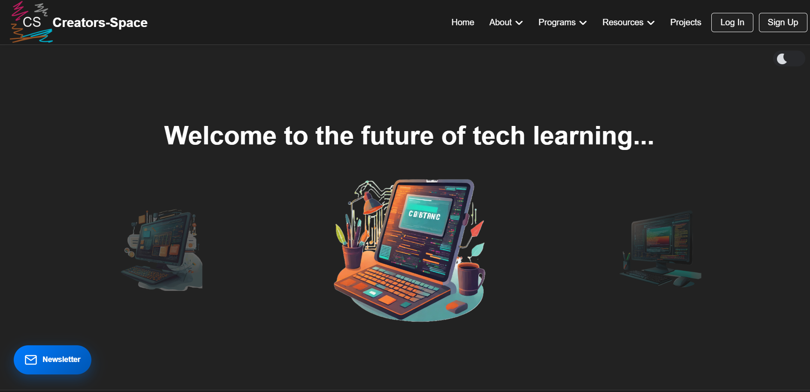
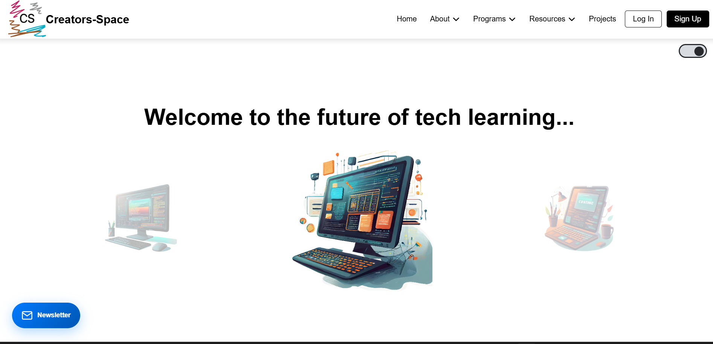
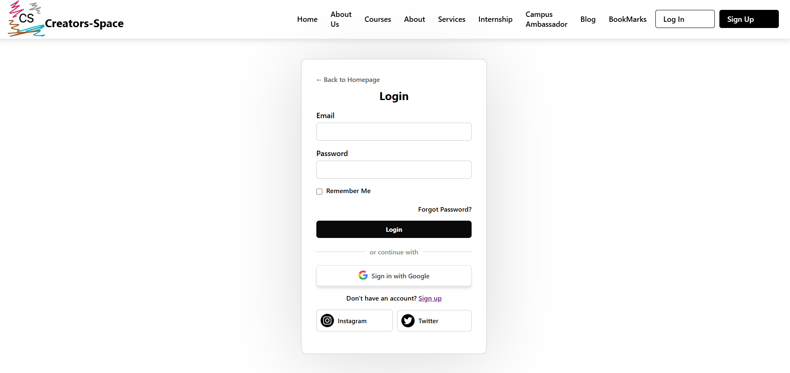
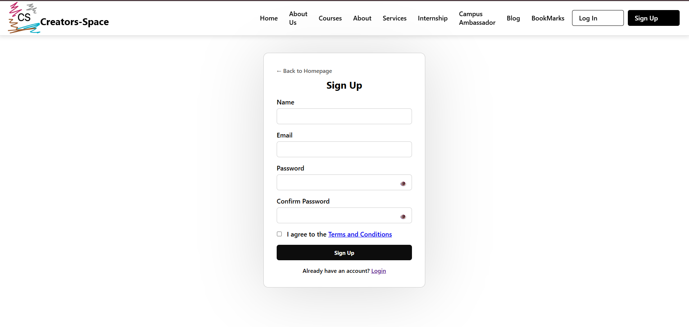
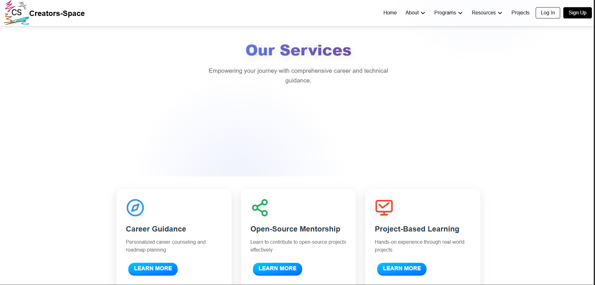
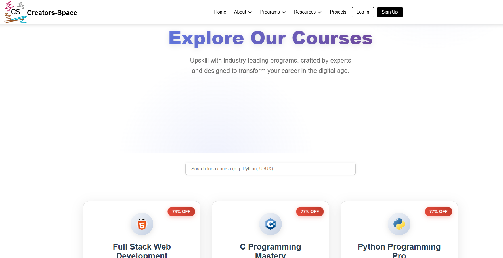
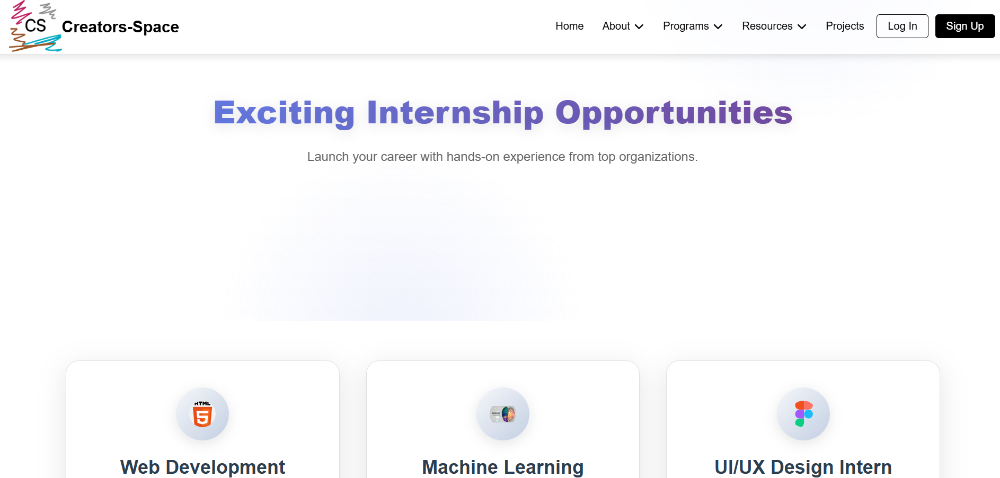
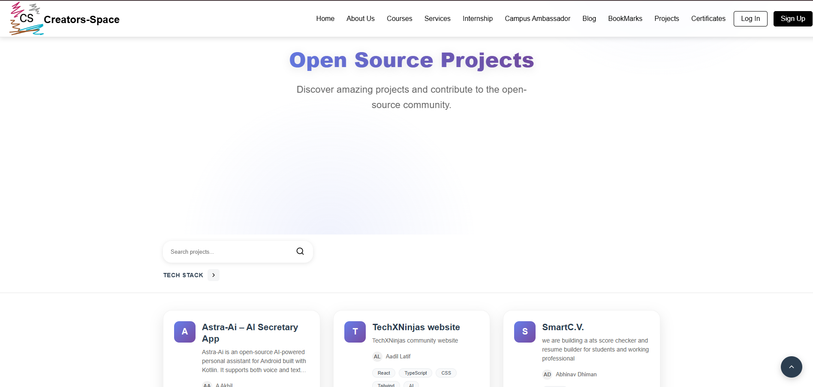

# 🌐 Creators-Space

<p align="center">
  
  <br/>
  <em>Empowering the next generation of tech creators</em>
</p>

<p align="center">
  <a href="https://creators-space.netlify.app/">🌐 Live Website</a> •
  <a href="#-features">✨ Features</a> •
  <a href="#-tech-stack">🛠 Tech Stack</a> •
  <a href="#-getting-started">🚀 Getting Started</a> •
  <a href="#-contributing">🤝 Contributing</a>
</p>

<p align="center">
  
  
  
</p>

## 📖 About

Creators-Space is a modern, innovative tech-learning platform designed to empower students and professionals through high-quality content, career-oriented resources, and hands-on project experience. Our mission is to bridge the gap between theoretical knowledge and practical implementation in the tech industry.

🔗 **Live Website:** [https://super-brigadeiros-b9a105.netlify.app/](https://super-brigadeiros-b9a105.netlify.app/)

---


## ✨ Features

- **📚 Comprehensive Courses** - Curated learning paths and tutorials across various tech domains
- **🎓 Career Guidance** - Professional development resources and mentorship opportunities
- **🔬 Hands-on Projects** - Open source projects categorized by tech stack and difficulty level
- **💼 Internship Program** - Real-world experience with industry-relevant projects
- **🌟 Campus Ambassador Program** - Leadership opportunities for student representatives
- **📝 Tech Blog** - Latest insights, tutorials, and industry trends
- **🔐 Secure Authentication** - Firebase-powered login/signup system with Google integration
- **🌙 Dark/Light Mode** - Personalized viewing experience
- **📱 Fully Responsive** - Optimized for all device sizes

---


## 🛠 Tech Stack

**Frontend:**
- HTML5, CSS3, JavaScript (ES6+)
- Responsive Design (Flexbox, CSS Grid)
- Firebase Authentication

**Development Tools:**
- Git & GitHub
- Netlify (Deployment)
- VS Code (Recommended IDE)

---

## 📁 Project Structure

```
Creators-Space/
├── assets/
│   ├── animations/ 
│   └── images/
│        ├── aboutpage/
│        ├── blogpage/
│        ├── icons/
│        ├── Certificate/
│        └── other-images
│
├── certificate/      
├── Screenshots
├── src/
├── about.html
├── apply.html
├── blog.html
├── bookmarked.html
├── campus-ambassador.html
├── CODE_OF_CONDUCT.md
├── CONTRIBUTING.md
├── courses.html
├── enroll.html
├── favicon.ico
├── freelancing.html
├── index.html
├── internship.html
├── LICENSE
├── login.html
├── newsletter-demo.html
├── profile.html
├── projects.html
├── README.md
├── script.js
├── services.html
├── signup.html
├── style.css
├── tandc.html
└── test-projects.html
```
---
## Screenshots
<table>
<tr align="center">
<td></td>
<td></td>
<td></td>
</tr>
<table>
<tr align="center">
<td></td>
<td></td>
<td></td>
</tr>
<tr align="center">
<td></td>
<td></td>
<td></td>
</tr>
</table>
  
  

---
## 🚀 Getting Started

### Prerequisites

- A modern web browser (Chrome, Firefox, Safari, Edge)
- Git installed on your system
- A code editor (VS Code recommended)

### Installation

1. **Clone the repository**
   ```bash
   git clone https://github.com/your-username/Creators-Space.git
   cd Creators-Space
   ```
2. **Set up Firebase (Optional for authentication features)**
- Create a Firebase project at https://console.firebase.google.com/
- Enable Authentication and add Google Sign-In provider
- Update the Firebase configuration in src/js/firebase.js:
```
const firebaseConfig = {
  apiKey: "YOUR_API_KEY",
  authDomain: "YOUR_AUTH_DOMAIN",
  projectId: "YOUR_PROJECT_ID",
  storageBucket: "YOUR_STORAGE_BUCKET",
  messagingSenderId: "YOUR_MESSAGING_SENDER_ID",
  appId: "YOUR_APP_ID",
  measurementId: "YOUR_MEASUREMENT_ID"
};
```
3. **Open the project**
- Simply open index.html in your web browser
  Start exploring!

4. **Navigate through different sections**
- Test authentication features (if Firebase is configured)
- Try the responsive design on different screen sizes
---
## 🤝 Contributing
We love contributions from the community! Here's how you can help:
- Fork the repository
- Create a feature branch (git checkout -b feature/amazing-feature)
- Commit your changes (git commit -m 'Add some amazing feature')
- Push to the branch (git push origin feature/amazing-feature)
- Open a Pull Request<br>
Please read our [CONTRIBUTING.md](./CONTRIBUTING.md) for detailed guidelines and our [CODE OF CONDUCT](./CODE_OF_CONDUCT.md)
---
## 📄 License
- This project is licensed under the MIT License - see the [LICENSE](./LICENSE) for details.
